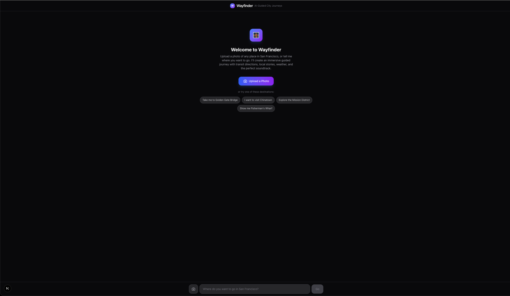

# WAYFINDER — AI-Guided Immersive City Journeys, From One Photo

Upload a photo of a place. Wayfinder identifies it, plans a public transit route from where you are, and builds an **immersive chapter-by-chapter guided journey** — not directions, but a full experience. Every bus ride, every transfer, every arrival gets its own AI narration, soundtrack, weather data, and points of interest.

**Live Demo:** [wayfinder-app.vercel.app](https://wayfinder-app.vercel.app)



## The Experience

1. **Upload a photo** (or type a destination) — Wayfinder's vision AI identifies the location
2. **Real-time context** — weather, transit routes, and knowledge base results appear instantly
3. **Begin Your Journey** — chapters reveal one at a time, each with:
   - Vivid AI narration written as a knowledgeable local friend
   - Spotify soundtrack matched to the segment mood (departure → transit → arrival)
   - Transit info with line numbers, stops, and transfer details
   - Points of interest you'll pass along the way
   - Audio narration via AI-generated text-to-speech

## Architecture

```
┌──────────────────────────────────────────────┐
│              Next.js Frontend                │
│  Custom React UI with progressive chapter    │
│  reveal, image upload, SSE stream parsing    │
├──────────────────────────────────────────────┤
│           Next.js API Route (/api/chat)      │
│  Direct Anthropic API calls with streaming   │
│  Tool execution: plan_journey, weather,      │
│  map, chapters, knowledge base, TTS          │
├──────────────────────────────────────────────┤
│           FastAPI Python Backend             │
│  Railtracks multi-agent orchestration        │
│  Google Maps, Augment Context Engine,        │
│  DigitalOcean Gradient (TTS, images),        │
│  Open-Meteo weather, Spotify integration     │
└──────────────────────────────────────────────┘
```

## Tech Stack & Sponsor Integrations

### DigitalOcean Gradient AI
- **Vision analysis** — Image identification using DO Gradient's OpenAI-compatible API with fallback to Claude
- **Text-to-Speech** — ElevenLabs TTS via DO Gradient's async-invoke API for chapter narration audio
- **Image generation** — fal-ai/flux/schnell via DO Gradient for AI-generated scene previews
- **LLM chat** — DO Gradient as primary inference with Claude fallback

### Railtracks Multi-Agent Framework
- **9 specialized agent nodes** orchestrated via `rt.Flow()`:
  - `identify_location_from_image` — Vision-based location identification
  - `geocode_place` — Google Maps geocoding
  - `get_weather_data` — Open-Meteo weather retrieval
  - `plan_transit_route` — Multi-segment public transit routing
  - `research_location` — Augment knowledge base search
  - `find_route_pois` — Points of interest discovery along route
  - `generate_chapter_narration` — Context-aware narration generation
  - `generate_scene_image` — AI image generation per chapter
  - `select_chapter_music` — Mood-based Spotify playlist matching
- Full `@rt.function_node` decorators with `rt.call()` orchestration

### Augment Code Context Engine
- **Custom San Francisco knowledge base** with 15+ indexed documents covering:
  - Neighborhoods (Mission, Castro, Chinatown, Haight-Ashbury, etc.)
  - Points of interest (Golden Gate Bridge, Alcatraz, cable cars, etc.)
  - Transit systems (BART, Muni, cable cars, ferries)
  - Food and dining by neighborhood
  - Historical context and hidden gems
  - Practical tips for visitors
- **Semantic search** via `DirectContext.search()` for location-aware narration
- **RAG queries** via `DirectContext.search_and_ask()` for contextual Q&A
- **Journey memory** — indexes past journeys for cross-journey search ("Show me all sunset spots I've saved")
- Auto-initializes on server startup for instant search

### assistant-ui Integration
- Custom tool UI components for rich rendering:
  - `generate_journey_chapter` — Chapter cards with gradient backgrounds, narration, transit info, POIs, Spotify embeds
  - `show_weather_card` — Weather display with temperature, conditions, humidity, wind, best-time tips
  - `show_map_route` — OpenStreetMap embed with segment timeline and POI markers
- Progressive chapter reveal with "Begin Journey" CTA and step-by-step navigation
- SSE stream parsing with real-time tool call rendering

### Additional Integrations
- **Google Maps APIs** — Geocoding, Directions (transit mode), Places for POI discovery
- **Spotify** — Zero-auth iframe embeds with 10 mood-to-playlist mappings for journey soundtrack arc
- **Open-Meteo** — Free weather API for real-time conditions and forecast at destination
- **Anthropic Claude** — Primary LLM for journey planning, narration, and vision analysis

## Key Features

- **Photo Upload + Vision AI**: Upload any photo — the system identifies landmarks, architecture, signage to name the location
- **Multi-Segment Transit Planning**: Real Google Maps transit directions broken into walkable journey chapters
- **Progressive Journey Reveal**: Chapters appear one at a time with smooth animations — like reading a story
- **Contextual AI Narration**: Each chapter has specific street names, historical facts, insider tips, things to notice
- **Mood-Matched Soundtrack**: Journey has a sonic arc from calm departure → energetic transit → celebratory arrival
- **Audio Narration (TTS)**: AI-generated voice narration for each chapter via DigitalOcean Gradient + ElevenLabs
- **Real-Time Weather**: Current conditions at destination with best-time-to-visit recommendations
- **Points of Interest**: Notable spots you'll pass along the route, surfaced between chapters
- **Knowledge Base Search**: Augment-powered semantic search over curated SF knowledge for enriched narration

## Running Locally

### Backend
```bash
cd backend
pip install -r requirements.txt
cp .env.example .env  # Add your API keys
python main.py
```

### Frontend
```bash
cd frontend/wayfinder-app
npm install
cp .env.local.example .env.local  # Add your API keys
npm run dev
```

### Required API Keys
- `ANTHROPIC_API_KEY` — Claude API for LLM and vision
- `DIGITAL_OCEAN_MODEL_ACCESS_KEY` — DO Gradient for TTS and image generation
- `AUGMENT_API_TOKEN` — Augment Context Engine for knowledge base
- `GOOGLE_MAPS_API_KEY` — Google Maps for geocoding and transit directions

## Demo Script (3 minutes)

1. **Welcome** (0:00-0:15): Show the Wayfinder landing page with hero and destination suggestions
2. **Upload Photo** (0:15-0:30): Upload a photo of the Golden Gate Bridge
3. **AI Processing** (0:30-1:00): Watch vision AI identify the location, plan_journey fetch real transit data, weather card and map appear
4. **Begin Journey** (1:00-1:15): Click "Begin Your Journey" — see the chapter count and journey stats
5. **Chapter Walkthrough** (1:15-2:30): Step through 4-5 chapters, highlighting:
   - Vivid local narration with specific details
   - Different Spotify moods per segment
   - Transit info with actual bus lines and stops
   - POIs along the route
   - Audio narration playing
6. **Journey Complete** (2:30-2:45): Show the completion screen
7. **Knowledge Base** (2:45-3:00): Ask a follow-up question to demonstrate Augment knowledge base search

## Hackathon Prize Tracks

- **Augment Code** ($3,500) — Deep Context Engine integration with 15+ indexed documents, semantic search, RAG, and journey memory
- **Railtracks** ($1,300) — Full multi-agent orchestration with 9 function nodes and Flow-based pipeline
- **DigitalOcean** ($1,000) — Vision, TTS, image generation, and LLM inference via Gradient AI
- **assistant-ui** ($800) — Custom tool UI components with progressive reveal and rich rendering
- **General** — Novel application combining transit, weather, music, narration, and knowledge into one immersive experience

## License

MIT
